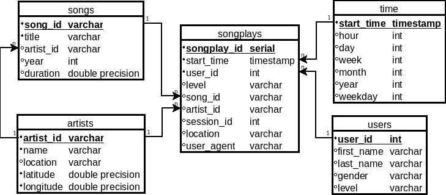

# Project 1: Data Modeling with Postgres

In this project, our goal is to build a PostgreSQL database from many datasets in JSON format for a startup called Sparkify. They have datasets collected from the activities of the users of a new music app and want to analyze it. In particular, they want to understand what songs the users are listening to. Since JSON format isn't very practical, we will deploy a PostgreSQL database so that the analytics team will be able to query data easily.

## Prerequisites

- Python 3
- `pandas`, `psycopg2` and `ipython-sql` packages
- A PostgreSQL database available on localhost

You can install the required packages using pip:

```bash
pip install pandas
pip install psycopg2-binary
pip install ipython-sql
```

Installing and configuring PostgreSQL is a little more difficult. I've installed and configured PostgreSQL using the following commands in Manjaro Linux>

```bash
# Installing postgresql
sudo pacman -S  postgresql

# Enabling and starting PostgreSQL
systemctl start postgresql.service
systemctl enable postgresql.service 
```

After installing PostgreSQL, I've created a username and a database following. First, you need to access `postgres` user:

```bash
sudo -iu postgres
psql
```

Then you can use the following command to create a new username `student` with the password `student`:

```bash
CREATE USER student WITH ENCRYPTED PASSWORD 'student';
```

The username `student` needs permission to create a new database and tables:

```bash
ALTER USER student SUPERUSER;
ALTER USER student CREATEDB;
ALTER USER student CREATEROLE;
```

Finally, I've created two databases, `sparkifydb` and `studentdb`:

```bash
CREATE DATABASE sparkifydb;
CREATE DATABASE studentdb;
```

## Running the codes

1. Creating the tables:

```bash
python create_table.py
```

2. Filling the tables with data:

```bash
python etl.py
```

## ETL process

We implement the following ERM diagram:



Our client has two groups of datasets. One of them is song data, for example `TRAAAAW128F429D538.json`, which contains information about individual songs as the artist identification, artist name, song name, etc.. We use song data to fill the tables `songs` and `artists`.

The other group of data is log data, which has information about the songs listened to by users at each moment of time. Each file has information for one day and we have data for every day of November 2018. We use log data to fill the tables `users` and `time`.

Finally, both log data and song data are used to fill the table `songplays`.

Our data model uses a star schema. `songplays` is a fact table. A **fact** is a *song*, which has an *artist*, listened by a *user* at a specific instant of *time*. From a fact, we can discover information about the song using `songs` table; we can discover information about the artist using `artists` table and we can discover details about the user using `users` table so that this schema is easy for the analytics team to access information using simple queries.

## Files

- `data/log_data` contains the JSON files of log data, that is, the facts;
- `data/song_data` contains the JSON files of songs, that is, information about the songs of the app;
- `sql_queries.py` contains the SQL queries used in the construction of the database;
- `create_table.py` drop the tables and create empty tables. If you want to fill the tables, firstly you should run this file;
- `etl.ipynb` is the instruction notebook for the project;
- `etl.py` is the Python script that reads and process files and insert into database;
- `test.ipynb` is the Udacity's notebook used to test if the database is right.
